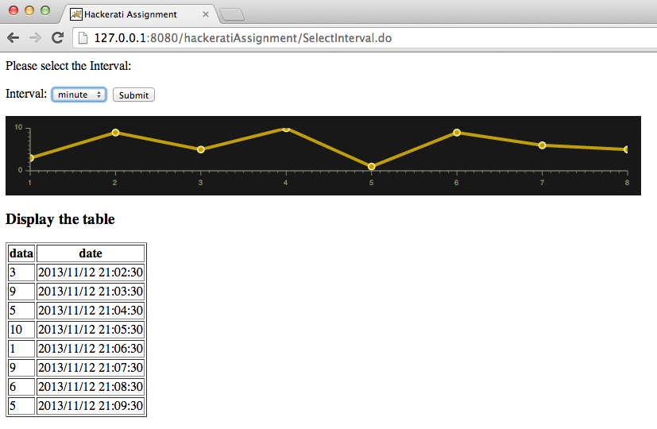

- Build a system to collect data that is generated on an interval (once a minute, an hour, etc.). Store in mysql database; record time/data and data value. 
- Build a web app that displays a graph of the collected data with a choice of intervals (per min, per hour, per day, etc.). Also, add a table report of the data with column headings. The table should be placed below the graph. 

For better scalability and reusability, I use “Observer” and MVC design pattern to design this system.

